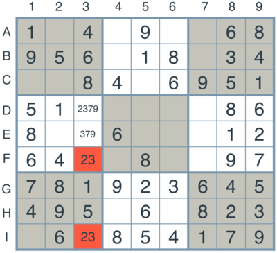

# Artificial Intelligence Nanodegree
## Introductory Project: Diagonal Sudoku Solver

# Question 1 (Naked Twins)
Q: How do we use constraint propagation to solve the naked twins problem?  
A: The constraint propagation is a strategy that: if two boxes in a unit have only two digits value possibilities, then those digits can only be solutions for those two boxes. 

As the picture above shows, if boxes A1 and B1 can only have 2 or 3, then it must be the case that one box has '2' and another box has '3' as a value. And there is no other boxes in the unit shared by A1 and B1 can be those values. 

After all the naked twins in all units of the Sudoku board are found, the algorithm implemented enforces this constraint. 

# Question 2 (Diagonal Sudoku)
Q: How do we use constraint propagation to solve the diagonal sudoku problem?  
A: The strategy is including the diagonals as an additional unit in sudoku:

enforcing the constraint that each of the two unit diagonals:  

[A1, B2, C3, D4, E5, F6, G7, H8, I9]  

[A9, B8, C7, D6, E5, F4, G3, H2, I1]  

each diagonals can only have one instance of each of the digit values 1, 2, 3, 4, 5, 6, 7, 8, 9 assigned to their constituent boxes as a part of a solution.  

All the diagonal entries will have the corresponding diagonal entries as their peers. 
And keeping track including elimination, only_choice, and naked_twins digit elimination. 
This will accept the solutions that satisfy the diagonal constraint. 

### Install

This project requires **Python 3**.

We recommend students install [Anaconda](https://www.continuum.io/downloads), a pre-packaged Python distribution that contains all of the necessary libraries and software for this project. 
Please try using the environment we provided in the Anaconda lesson of the Nanodegree.

##### Optional: Pygame

Optionally, you can also install pygame if you want to see your visualization. If you've followed our instructions for setting up our conda environment, you should be all set.

If not, please see how to download pygame [here](http://www.pygame.org/download.shtml).

### Code

* `solution.py` - You'll fill this in as part of your solution.
* `solution_test.py` - Do not modify this. You can test your solution by running `python solution_test.py`.
* `PySudoku.py` - Do not modify this. This is code for visualizing your solution.
* `visualize.py` - Do not modify this. This is code for visualizing your solution.

### Visualizing

To visualize your solution, please only assign values to the values_dict using the `assign_value` function provided in solution.py

### Submission
Before submitting your solution to a reviewer, you are required to submit your project to Udacity's Project Assistant, which will provide some initial feedback.  

The setup is simple.  If you have not installed the client tool already, then you may do so with the command `pip install udacity-pa`.  

To submit your code to the project assistant, run `udacity submit` from within the top-level directory of this project.  You will be prompted for a username and password.  If you login using google or facebook, visit [this link](https://project-assistant.udacity.com/auth_tokens/jwt_login) for alternate login instructions.

This process will create a zipfile in your top-level directory named sudoku-<id>.zip.  This is the file that you should submit to the Udacity reviews system.

